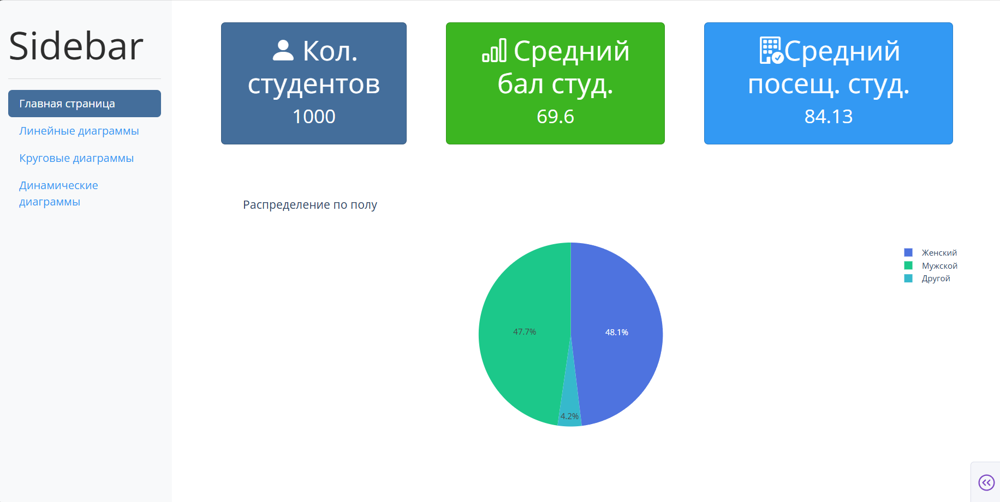

### Визуальный интерфейс

#### Главная страница

При переходе на ссылку - http://127.0.0.1:8050/ мы переходим на сайт с главной страницей:

1. Отображение количество студентов, средний бал всех студентов, средняя посещаемость всех студентов, круговая диаграмма с распределением по полу![[Pasted image 20250423103324.png]]
2. Возможность фильтровать студентов по уровню образования их родителей![[Pasted image 20250423102503.png]]
3. Возможность скачивания всех данных о студентах, так и отфильтрованных данных по уровню образования студентов![[Pasted image 20250423103127.png]]
4. Слева сайт понель, по которой можно передвигаться по сайту![[Снимок экрана 2025-04-23 103323.png]]

#### Линейные диаграммы![[Pasted image 20250423103654.png]]
1. При переходи по кнопке "Линейные диаграммы" мы переходи на эту страницу![[Pasted image 20250423103703.png]]

#### Круговые диаграммы
![[Pasted image 20250423103749.png]]
1. При переходи по кнопке "Круговые диаграммы" мы переходи на эту страницу![[Pasted image 20250423103757.png]]

#### Динамические диаграммы![[Pasted image 20250423103828.png]]
1. Здесь мы можем фильтровать данные по возрасту и они будут меняться на графике, так и на таблице данных ![[Pasted image 20250423103949.png]]![[Pasted image 20250423104002.png]]
2. Каждая точка имеет цвет в зависимости от возраста студента, индикатор возраста показан справа от таблиц![[Pasted image 20250423104104.png]]
3. Так же можно скачать данные о студентах, в указанном диапазоне возраста студента.![[Pasted image 20250423104157.png]] 
